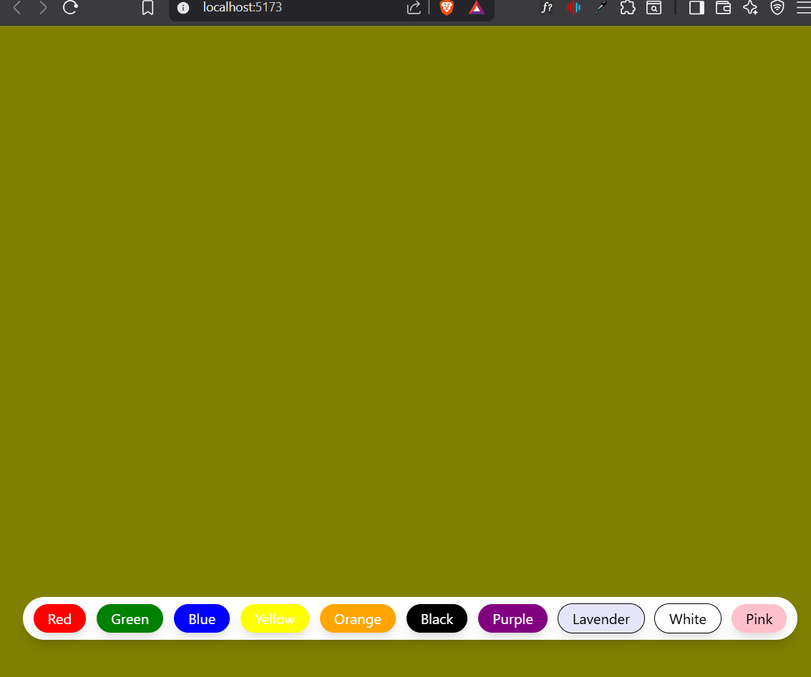

# React Background Changer

A simple React application that allows users to change the background color of the page with a single click. This project was built to practice React fundamentals such as state management and event handling.

## Preview

## Features

* 🎨 Dynamically changes the background color
* ⚛️ Built using React functional components
* 🪝 Uses the `useState` hook for state management
* 📱 Responsive and minimal user interface

## Tech Stack

* React
* JavaScript (ES6+)
* Tailwind CSS
* Vite

## Learning Outcomes

Through this project, I practiced:

* React component structure
* State management with `useState`
* Event handling in React
* Dynamic UI updates
* Styling with Tailwind CSS

## Installation

1. Clone the repository

```bash
git clone <https://github.com/ShauryGupta07/bg-changer.git>
```

2. Navigate to the project directory

```bash
cd <bg-changer>
```

3. Install dependencies

```bash
npm install
```

4. Start the development server

```bash
npm run dev
```

## Future Improvements

* Add smooth background transition animations
* Allow users to choose custom colors
* Save the selected background color using Local Storage
* Add dark/light mode support

## Author

**Shaury Gupta**

